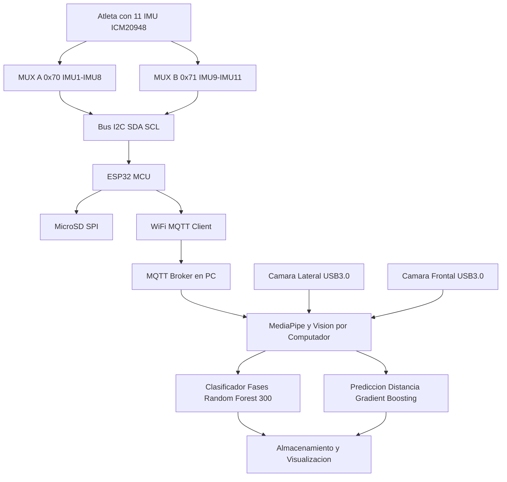

# Sistema de Análisis Biomecánico de Saltos

## Descripción del Proyecto

Este prototipo simula el sistema híbrido inercial-visual propuesto en la tesis "Metodología Híbrida Inercial-Visual para el Análisis Técnico y Físico del Salto largo en Deportistas". El sistema utiliza **MediaPipe** para detectar poses humanas y calcular métricas biomecánicas en tiempo real, además se incorporá la lectura desde sensores inerciales (IMU) que cuentan con magnetometro para la ubicación espacial o geolocalización del sujeto de prueba, tambien para acceder a datos como acelearación lineal que nos permite el cálculo de la fuerza que actúa sobre nuestro sujeto, y el cálculo de la velocidad angular, para saber la rapidez con que nuestro deportista se mueve desde el punto de partida hasta las fases de punto de despegue, y posterior punto de aterrizaje.

**NOTA:** Esta es una metodología para el diseño de este prototipo de forma completamente funcional, nuestro principal interés además de academico es satisfacer la creciente demanda de estos sistemas que aporten al deporte colombiano, contribuyendo en que desde diferentes sectores, poblaciones sin importar sus ingresos puedan acceder a entrenamientos que los acerquen a cumplir sus sueños de participar en estas competencias y lograr mejorar el rendimiento con estándares de deportistas profesionales, formando desde la electrónica y machine learning, personas con altos niveles de entrenamiento y aumentar las posibilidades de estar al nivel internacional de grandes figuras en el **salto largo**.

## Composición de modelo

Este modelo corre sobre el framework de mediapipe, con el fin de encontrar landmarks para el cubrimiento completo del cuerpo humano y el principal objetivo de adquirir datos visuales importantes en el salto largo, para esto se diseñaron 3 clases diferentes que permiten generar la diversificación e inclución de los datos referentes a la POSE del sujeto de prueba, se adiciono grabación en tiempo real sobre el cuerpo con los landmarks escritos en los 33 puntos que provee.

### Arquitectura del proyecto

