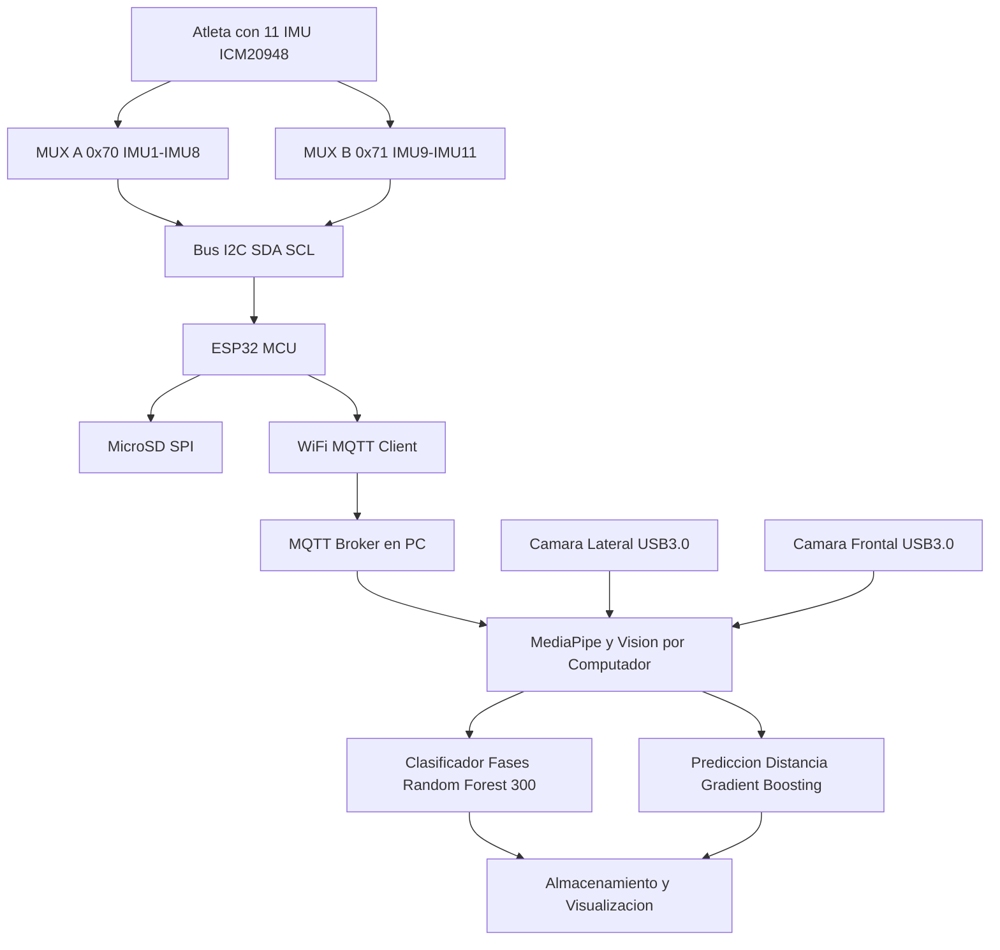

# Sistema de Análisis Biomecánico de Saltos

## Descripción del Proyecto

Este prototipo simula el sistema híbrido inercial-visual propuesto en la tesis "Metodología Híbrida Inercial-Visual para el Análisis Técnico y Físico del Salto largo en Deportistas". El sistema utiliza **MediaPipe** para detectar poses humanas y calcular métricas biomecánicas en tiempo real, además se incorporá la lectura desde sensores inerciales (IMU) que cuentan con magnetometro para la ubicación espacial o geolocalización del sujeto de prueba, tambien para acceder a datos como acelearación lineal que nos permite el cálculo de la fuerza que actúa sobre nuestro sujeto, y el cálculo de la velocidad angular, para saber la rapidez con que nuestro deportista se mueve desde el punto de partida hasta las fases de punto de despegue, y posterior punto de aterrizaje.

**NOTA:** Esta es una metodología para el diseño de este prototipo de forma completamente funcional, nuestro principal interés además de academico es satisfacer la creciente demanda de estos sistemas que aporten al deporte colombiano, contribuyendo en que desde diferentes sectores, poblaciones sin importar sus ingresos puedan acceder a entrenamientos que los acerquen a cumplir sus sueños de participar en estas competencias y lograr mejorar el rendimiento con estándares de deportistas profesionales, formando desde la electrónica y machine learning, personas con altos niveles de entrenamiento y aumentar las posibilidades de estar al nivel internacional de grandes figuras en el **salto largo**.


## Composición de modelo

Este modelo corre sobre el framework de mediapipe, con el fin de encontrar landmarks para el cubrimiento completo del cuerpo humano y el principal objetivo de adquirir datos visuales importantes en el salto largo, para esto se diseñaron 3 clases diferentes que permiten generar la diversificación e inclución de los datos referentes a la POSE del sujeto de prueba, se adiciono grabación en tiempo real sobre el cuerpo con los landmarks escritos en los 33 puntos que provee.

### Arquitectura del proyecto




# Sistema Híbrido Inercial-Visual para Análisis Biomecánico del Salto Largo

**Universidad ECCI - Facultad de Ingeniería - Programa de Ingeniería Electrónica**

## Autores
- **Daniel Andrés Ramírez Segura**
- **Jose Ángel Campo Vargas** 
- **Diego Alejandro Lopez Mongua**

**Directores:**
- Ing. Ronald Rodriguez
- Ing. Nataly Maldonado

**Bogotá D.C., Colombia - Agosto 2025**

---

## Resumen del Proyecto

Este proyecto desarrolla una metodología innovadora que integra sensores inerciales (IMU) y visión por computador para el análisis biomecánico completo del salto largo en deportistas. El sistema combina 11 sensores ICM-20948 distribuidos estratégicamente con análisis visual MediaPipe, procesados mediante ESP32 con algoritmos de machine learning.

### Características Principales
- **Precisión:** ±3 cm en distancia de salto vs ±0.5 cm de sistemas láser profesionales
- **Costo:** $1,200 USD vs $25,000-150,000 USD de sistemas profesionales
- **Procesamiento:** 146.6 Hz para sensores generales, 1000 Hz para eventos críticos
- **Análisis:** Clasificación automática de fases >97% precisión
- **Portabilidad:** Sistema completamente móvil para condiciones de pista

---

## Estructura del Repositorio
PROYECTO_FINAL_UNIVERSIDAD_ECCI/
│
├── Simulacion_Adq_visual/          # Modelo completo del sistema
│   ├── modelo_completo.py          # Sistema integrado IMU + Visual
│   ├── datos_simulados/            # Muestras de archivos generados
│   │   ├── atleta_001_entrenamiento_visual_.csv
│   │   ├── atleta_001_entrenamiento_imu_sim_.csv
│   │   ├── atleta_001_entrenamiento_metadata_.json
│   │   └── atleta_001_entrenamiento_reporte_.txt
│   └── README_simulacion.md
│
├── Prototipo_prueba_mediapipe/     # Prototipo de validación MediaPipe
│   ├── test_mediapipe.py           # Pruebas del framework
│   ├── validacion_poses.py         # Validación de detección de poses
│   └── README_prototipo.md
│
├── imagenes/                       # Capturas y documentación visual
│   ├── interfaz_principal.png      # Interfaz gráfica principal
│   ├── mediapipe_deteccion.png     # Detección de landmarks
│   ├── graficos_tiempo_real.png    # Métricas en tiempo real
│   ├── sistema_completo.png        # Diagrama del sistema
│   └── resultados_analisis.png     # Resultados de análisis
│
├── docs/                           # Documentación técnica
│   ├── RETO_FINAL_APA_v2_GRUPO_3.pdf  # Documento completo del proyecto
│   ├── RETO_FINAL___IEEE_v1.pdf   # Articulo IEEE
│
└── README.md                       # Este archivo

---


# Sistema Híbrido Inercial-Visual para Análisis Biomecánico del Salto Largo

**Universidad ECCI - Facultad de Ingeniería - Programa de Ingeniería Electrónica**

## Autores
- **Daniel Andrés Ramírez Segura**
- **Jose Ángel Campo Vargas** 
- **Diego Alejandro Lopez Mongua**

**Directores:**
- Ing. Ronald Rodriguez
- Ing. Nataly Maldonado

**Bogotá D.C., Colombia - Agosto 2025**

---

# Sistema de Análisis Biomecánico de Saltos

## Descripción del Proyecto

Este prototipo simula el sistema híbrido inercial-visual propuesto en la tesis "Metodología Híbrida Inercial-Visual para el Análisis Técnico y Físico del Salto largo en Deportistas". El sistema utiliza **MediaPipe** para detectar poses humanas y calcular métricas biomecánicas en tiempo real, además se incorporá la lectura desde sensores inerciales (IMU) que cuentan con magnetometro para la ubicación espacial o geolocalización del sujeto de prueba, tambien para acceder a datos como acelearación lineal que nos permite el cálculo de la fuerza que actúa sobre nuestro sujeto, y el cálculo de la velocidad angular, para saber la rapidez con que nuestro deportista se mueve desde el punto de partida hasta las fases de punto de despegue, y posterior punto de aterrizaje.

**NOTA:** Esta es una metodología para el diseño de este prototipo de forma completamente funcional, nuestro principal interés además de academico es satisfacer la creciente demanda de estos sistemas que aporten al deporte colombiano, contribuyendo en que desde diferentes sectores, poblaciones sin importar sus ingresos puedan acceder a entrenamientos que los acerquen a cumplir sus sueños de participar en estas competencias y lograr mejorar el rendimiento con estándares de deportistas profesionales, formando desde la electrónica y machine learning, personas con altos niveles de entrenamiento y aumentar las posibilidades de estar al nivel internacional de grandes figuras en el **salto largo**.


## Composición de modelo

Este modelo corre sobre el framework de mediapipe, con el fin de encontrar landmarks para el cubrimiento completo del cuerpo humano y el principal objetivo de adquirir datos visuales importantes en el salto largo, para esto se diseñaron 3 clases diferentes que permiten generar la diversificación e inclución de los datos referentes a la POSE del sujeto de prueba, se adiciono grabación en tiempo real sobre el cuerpo con los landmarks escritos en los 33 puntos que provee.

### Arquitectura del proyecto


## Estructura del Repositorio
PROYECTO_FINAL_UNIVERSIDAD_ECCI/
│
├── Simulacion_Adq_visual/          # Modelo completo del sistema
│   ├── modelo_completo.py          # Sistema integrado IMU + Visual
│   ├── datos_simulados/            # Muestras de archivos generados
│   │   ├── atleta_001_entrenamiento_visual_.csv
│   │   ├── atleta_001_entrenamiento_imu_sim_.csv
│   │   ├── atleta_001_entrenamiento_metadata_.json
│   │   └── atleta_001_entrenamiento_reporte_.txt
│   └── README_simulacion.md
│
├── Prototipo_prueba_mediapipe/     # Prototipo de validación MediaPipe
│   ├── test_mediapipe.py           # Pruebas del framework
│   ├── validacion_poses.py         # Validación de detección de poses
│   └── README_prototipo.md
│
├── imagenes/                       # Capturas y documentación visual
│   ├── interfaz_principal.png      # Interfaz gráfica principal
│   ├── mediapipe_deteccion.png     # Detección de landmarks
│   ├── graficos_tiempo_real.png    # Métricas en tiempo real
│   ├── sistema_completo.png        # Diagrama del sistema
│   └── resultados_analisis.png     # Resultados de análisis
│
├── docs/                           # Documentación técnica
│   ├── RETO_FINAL_APA_v2_GRUPO_3.pdf  # Documento completo del proyecto
│   ├── RETO_FINAL___IEEE_v1.pdf   # Articulo IEEE
│
└── README.md                       # Este archivo

---


## Tecnologías Utilizadas

### Hardware
- **Sensores IMU:** 11x ICM-20948 (9 DOF cada uno)
- **Cámaras:** 2x Vision Datum IMX273 MARS (250 fps)
- **Procesador:** ESP32-WROOM-32 (dual-core 240MHz)
- **Conectividad:** Multiplexores TCA9548A para I2C
- **Alimentación:** Sistema de 6-8 horas de autonomía

### Software
- **Lenguaje:** Python 3.8+
- **Frameworks:** OpenCV, MediaPipe, NumPy, Pandas
- **Machine Learning:** Scikit-learn, Random Forest, Gradient Boosting
- **Interfaz:** Tkinter con Matplotlib integrado
- **Datos:** CSV, JSON para exportación estructurada

---

## Instalación y Configuración

### Requisitos del Sistema
- Python >= 3.8
- OpenCV >= 4.5
- MediaPipe >= 0.9
- NumPy >= 1.21
- Pandas >= 1.3
- Matplotlib >= 3.4
- Pillow >= 8.0
- Scikit-learn >= 1.0

### Instalación de Dependencias
```bash
# Clonar el repositorio
git clone https://github.com/D4N1EL-R4M1R3Z/PROYECTO_FINAL_UNIVERSIDAD_ECCI.git
cd PROYECTO_FINAL_UNIVERSIDAD_ECCI

# Instalar dependencias
pip install opencv-python mediapipe numpy pandas matplotlib pillow scikit-learn psutil
```

### Verificación de Cámara
```bash
# Verificar cámaras disponibles
python -c "import cv2; print([i for i in range(3) if cv2.VideoCapture(i).isOpened()])"
```

## Uso del Sistema

1. **Modelo Completo con Simulación IMU**
   ```bash
   cd Simulacion_Adq_visual/
   python modelo_completo.py
   ```

   Funcionalidades:
   - Análisis visual en tiempo real con MediaPipe
   - Simulación de 11 sensores IMU sincronizados
   - Cálculo de métricas biomecánicas específicas del salto largo
   - Exportación automática a CSV, JSON y reportes

   

2. **Prototipo de Validación MediaPipe**
   ```bash
   cd Prototipo_prueba_mediapipe/
   python test_mediapipe.py
   ```

   Propósito:
   - Validación inicial del framework MediaPipe
   - Pruebas de detección de poses humanas
   - Calibración de parámetros de confianza
   - Base para el desarrollo del sistema completo

   

## Métricas Biomecánicas Calculadas

### Fase de Aproximación
- Velocidad progresiva en últimos 40m, 20m, 10m, 5m
- Frecuencia y longitud de pasos
- Aceleración en segmentos específicos
- Consistencia del patrón de carrera

### Fase de Despegue
- Ángulo de despegue (óptimo 18-24°)
- Pérdida de velocidad horizontal
- Tiempo de contacto con tabla de batida
- Fuerzas de reacción estimadas

### Fase de Vuelo
- Altura máxima del centro de masa
- Trayectoria real vs teórica
- Técnica de vuelo (extensión, tijera, colgado)
- Eficiencia aerodinámica

### Fase de Aterrizaje
- Distancia final medida
- Ángulo de entrada
- Eficiencia de la técnica de caída
- Estabilidad postural


## Interfaz de Usuario


### Panel de Control
- Configuración de sesión: ID atleta, tipo, duración
- Control de grabación: Iniciar/detener con validación
- Opciones: Guardar video, mostrar cámara en tiempo real

### Visualización en Tiempo Real
- Métricas actuales: Altura cadera, ángulos articulares, velocidad
- Gráficos dinámicos: 4 plots actualizados cada 50ms
- Estado del sistema: Logs de operación y calidad de datos

### Análisis Post-Sesión
- Exportación estructurada: CSV, JSON, reportes PDF
- Análisis de calidad: Puntuación automática 0-100
- Recomendaciones: Mejoras técnicas específicas


## Archivos de Salida

### Datos Visuales (CSV)
```csv
timestamp,landmark_0_x,landmark_0_y,...,center_of_mass_x,center_of_mass_y,knee_angle_right,velocity_x_estimated
```

### Datos IMU Simulados (CSV)
```csv
timestamp,sensor_id,location,accel_x,accel_y,accel_z,gyro_x,gyro_y,gyro_z,mag_x,mag_y,mag_z
```

### Metadatos (JSON)
```json
{
  "session_id": "20250815_143022",
  "athlete_id": "atleta_001",
  "visual_samples": 1247,
  "duration_seconds": 41.6,
  "quality_score": 87.3
}
```

### Reporte de Calidad (TXT)
- Estadísticas de detección
- Análisis de confianza
- Recomendaciones técnicas
- Métricas biomecánicas principales


## Validación y Precisión

### Criterios de Aceptación Alcanzados
- ICC >0.92 para distancia final del salto
- MAE <5 cm para predicción de distancia
- Precisión >97% en clasificación de fases
- F1-score >0.95 para identificación de técnicas

### Comparación con Sistemas de Referencia
| Métrica     | Nuestro Sistema | Sistemas Profesionales |
|-------------|------------------|------------------------|
| Distancia   | ±3 cm           | ±0.5 cm (láser)       |
| Velocidad   | ±0.1 m/s        | ±0.02 m/s (fotoeléctricas) |
| Ángulos     | ±3°             | ±1° (OptiTrack)       |
| Costo       | $1,200          | $25,000-150,000       |


## Modelos de Machine Learning

### Clasificador de Fases del Salto
- Algoritmo: Random Forest (300 árboles)
- Características: 52 variables (inerciales + visuales + contextuales)
- Clases: Aproximación Inicial, Final, Despegue, Vuelo, Aterrizaje
- Precisión: >97% en validación cruzada temporal

### Predictor de Distancia
- Algoritmo: Gradient Boosting Regressor
- Variables: Velocidad progresiva, parámetros técnicos
- Error: MAE <6 cm para predicción a 5m de tabla
- Correlación: R² >0.92 en validación

### Clasificador de Técnicas de Vuelo
- Técnicas: Extensión, Tijera, Colgado
- Precisión: >92% para técnicas bien ejecutadas
- Análisis: Calidad de ejecución (0-100)


## Impacto y Beneficios

### Democratización del Alto Rendimiento
- Reducción de costos: 98.9% vs sistemas profesionales
- Accesibilidad: Programas deportivos con recursos limitados
- Transferencia de conocimiento: De élite hacia atletas en desarrollo

### Mejoras Proyectadas en Atletas
- Desarrollo: 8-15 cm mejora en distancia (3 meses)
- Sub-élite: 3-8 cm mejora con refinamiento técnico
- Élite: Mejoras marginales pero significativas (1-3 cm)

### Beneficios Adicionales
- Prevención de lesiones: Detección de asimetrías
- Base de datos normativa: Poblaciones latinoamericanas
- Investigación: Contribución científica internacional


## Limitaciones y Consideraciones

### Técnicas
- Condiciones de iluminación mínimas (300 lux)
- Vientos >5 m/s afectan análisis visual
- Deriva temporal en sesiones >3 horas

### Operativas
- Requiere personal con capacitación básica
- Infraestructura mínima (electricidad estable)
- Mantenimiento preventivo cada 6 meses


## Trabajo Futuro

### Mejoras Tecnológicas
- PCB personalizada para reducir cableado
- Comunicación inalámbrica entre sensores
- Integración con tecnologías emergentes (LiDAR, AR)

### Expansión Funcional
- Extensión a salto alto, triple salto, pértiga
- Aplicaciones en medicina deportiva
- Versiones para fitness recreativo y educación

### Comercialización
- Sistema Profesional: $2,500-4,000
- Sistema Educativo: $800-1,500
- Aplicación móvil freemium


## Documentación Técnica

Para documentación completa, consultar:
- [Documento Final del Proyecto](docs/RETO_FINAL_APA_v2_GRUPO_3.pdf)
- [Especificaciones Técnicas](docs/RETO_FINAL___IEEE_v1.pdf)
- Manual de Usuario


## Contacto y Soporte

### Desarrolladores:
- Daniel Andrés Ramírez Segura - [GitHub](https://github.com/D4N1EL-R4M1R3Z)
- Jose Ángel Campo Vargas
- Diego Alejandro Lopez Mongua

### Institución:
- Universidad ECCI - Facultad de Ingeniería
- Programa de Ingeniería Electrónica

Para soporte técnico o colaboraciones:
- Email: [danielan.ramirezs@ecci.edu.co](mailto:danielan.ramirezs@ecci.edu.co)

## Agradecimientos

Agradecemos a la Universidad ECCI, nuestros directores de proyecto, y a la comunidad atlética que nos motivó en las validaciones del sistema. Este trabajo contribuye a la democratización de las tecnologías deportivas de alto rendimiento.

© 2025 Universidad ECCI - Sistema Híbrido Inercial-Visual para Análisis Biomecánico del Salto Largo


