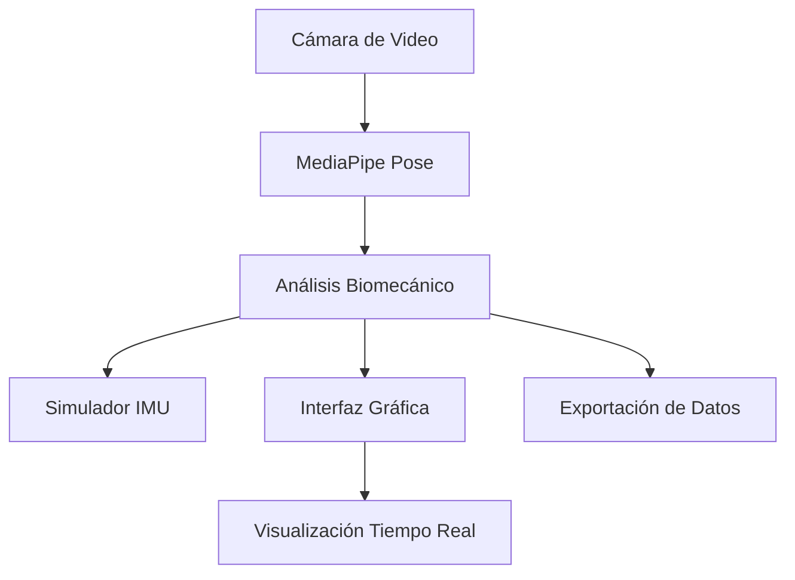

# Sistema de Adquisición de Datos Biomecánicos para Análisis de Salto Largo

## Objetivo del Proyecto

Este notebook presenta un **sistema híbrido de adquisición de datos biomecánicos** diseñado específicamente para el análisis del salto largo en atletismo. El sistema integra análisis de video en tiempo real con simulación de datos inerciales (IMU) para proporcionar métricas biomecánicas completas.

---

## Contexto Biomecánico

### ¿Por qué es importante el análisis biomecánico en salto largo?

El salto largo es una disciplina técnicamente compleja que requiere la optimización de múltiples variables biomecánicas:

- **Velocidad de aproximación**: Fundamental para la distancia final
- **Técnica de despegue**: Ángulo y eficiencia de la fase de impulso  
- **Mecánica de vuelo**: Optimización de la trayectoria del centro de masa
- **Técnica de aterrizaje**: Maximización de la distancia oficial

### Variables biomecánicas clave:
- **Centro de masa corporal** y su trayectoria
- **Ángulos articulares** (especialmente rodilla y cadera)
- **Simetría bilateral** en el movimiento
- **Velocidad horizontal** estimada
- **Métricas de calidad** de la ejecución técnica

---

## Arquitectura del Sistema

### Componentes principales:



### 1. **Adquisición Visual** (`CameraDataAcquisition`)
- Captura de video desde webcam o cámara profesional
- Detección de 33 landmarks corporales usando MediaPipe
- Extracción de métricas biomecánicas en tiempo real
- Control de calidad de la detección

### 2. **Simulación IMU** (`IMUSimulator`) 
- Simulación de 11 sensores IMU distribuidos en el cuerpo
- Generación de datos de acelerómetro, giroscopio y magnetómetro
- Correlación inteligente con el movimiento visual detectado
- Preparación para integración con IMUs reales

### 3. **Interfaz de Usuario** (`BiomechanicalInterface`)
- Panel de control para configuración de sesiones
- Visualización de métricas en tiempo real
- Gráficos dinámicos de variables biomecánicas
- Sistema de logging y monitoreo

---

## Métricas Biomecánicas Calculadas

### Análisis Postural:
- **Centro de masa (COM)**: Calculado usando pesos segmentales antropométricos
- **Altura de cadera**: Indicador de la fase del movimiento
- **Ángulo de rodilla**: Análisis de la mecánica articular
- **Ángulo del tronco**: Inclinación respecto a la vertical

### Análisis de Movimiento:
- **Velocidad horizontal estimada**: Basada en desplazamiento del COM
- **Índice de simetría bilateral**: Comparación izquierda vs derecha
- **Métricas de calidad**: Confianza y completitud de la detección

### Datos IMU Simulados:
- **Aceleración triaxial** (m/s²) para cada sensor
- **Velocidad angular** (°/s) en tres ejes
- **Campo magnético** (µT) para orientación
- **Ubicaciones**: cabeza, brazos, antebrazos, pecho, lumbar, muslos, tobillos

---

## Modo de Operación

### Configuración de Sesión:
- **ID del Atleta**: Identificación única
- **Tipo de Sesión**: Entrenamiento, competencia, evaluación, rehabilitación
- **Duración**: Control automático de grabación

### Flujo de Trabajo:
1. **Inicialización**: Conexión y configuración de la cámara
2. **Calibración**: Posicionamiento del atleta en el campo visual
3. **Grabación**: Captura sincronizada de video y simulación IMU
4. **Monitoreo**: Visualización de métricas en tiempo real
5. **Exportación**: Generación de datasets y reportes

---

## Estructura de Datos de Salida

### Archivos Generados:
- **`*_visual_*.csv`**: Datos de landmarks y métricas biomecánicas
- **`*_imu_sim_*.csv`**: Datos simulados de sensores inerciales  
- **`*_metadata_*.json`**: Información de la sesión y configuración
- **`*_reporte_*.txt`**: Análisis estadístico automático

### Formato de Datos:
- **Separador**: `;` (formato europeo)
- **Decimal**: `,` (estándar europeo)
- **Encoding**: UTF-8
- **Timestamps**: Sincronización temporal precisa

---

## Requisitos Técnicos

### Dependencias de Python:
```python
opencv-python>=4.5.0    # Captura y procesamiento de video
mediapipe>=0.8.0        # Detección de pose humana
pandas>=1.3.0           # Manipulación de datos
numpy>=1.21.0           # Computación numérica
matplotlib>=3.4.0       # Visualización de datos
tkinter                 # Interfaz gráfica (incluido en Python)
```

### Hardware Recomendado:
- **Cámara**: Webcam HD (mínimo 720p) o cámara profesional
- **CPU**: Procesador multi-core para procesamiento en tiempo real
- **RAM**: Mínimo 4GB (recomendado 8GB)
- **Almacenamiento**: Espacio suficiente para datasets (~100MB por sesión)


---

## Ventajas del Sistema

### **Ventajas Técnicas:**
- **No invasivo**: Sin necesidad de marcadores físicos
- **Tiempo real**: Feedback inmediato durante el entrenamiento
- **Escalable**: Preparado para hardware profesional
- **Portátil**: Funciona con equipo básico (webcam)

### **Ventajas Científicas:**
- **Reproducible**: Protocolos estandarizados
- **Cuantitativo**: Métricas objetivas y precisas
- **Longitudinal**: Seguimiento de progreso temporal
- **Interoperable**: Datos exportables a otros sistemas

---

## Próximos Pasos

### Desarrollo Inmediato:
1. **Validación con webcam**: Pruebas con movimientos controlados
2. **Optimización de algoritmos**: Mejora de precisión biomecánica
3. **Expansión de métricas**: Análisis de fases específicas del salto

### Desarrollo Futuro:
1. **Integración IMU real**: Sustitución de simulación por sensores físicos
2. **Análisis automático**: Detección automática de fases del salto
3. **Machine Learning**: Predicción de rendimiento y detección de patrones
4. **Análisis 3D**: Reconstrucción tridimensional del movimiento

---

## Referencias Bibliográficas

- **Biomecánica del Salto Largo**: Hay, J.G. (1993). *The Biomechanics of Sports Techniques*
- **Análisis de Marcha**: Winter, D.A. (2009). *Biomechanics and Motor Control of Human Movement*
- **MediaPipe Framework**: Lugaresi, C. et al. (2019). *MediaPipe: A Framework for Building Perception Pipelines*
- **Pesos Segmentales**: de Leva, P. (1996). *Adjustments to Zatsiorsky-Seluyanov's segment inertia parameters*

---
## Desarrollado por Daniel Andres Ramirez Segura - Universidad ECCI - Facultad de Ingeniería Electrónica
